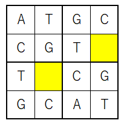
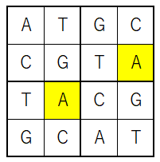
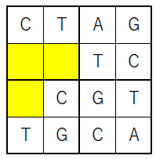
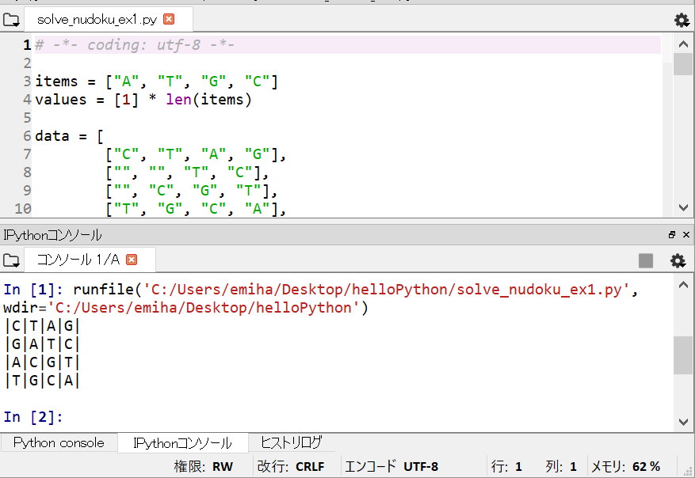
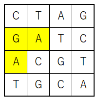
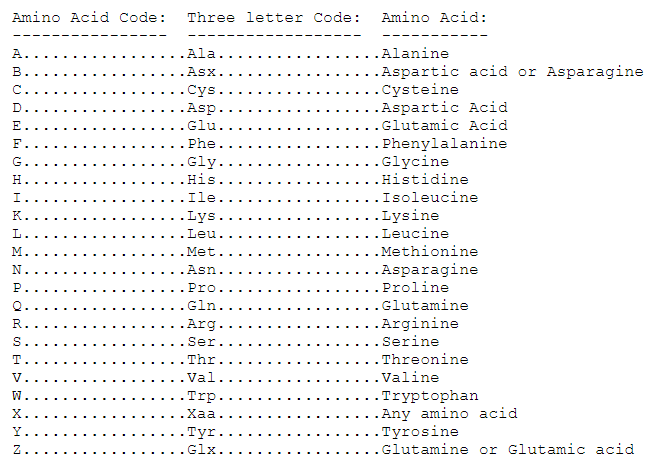
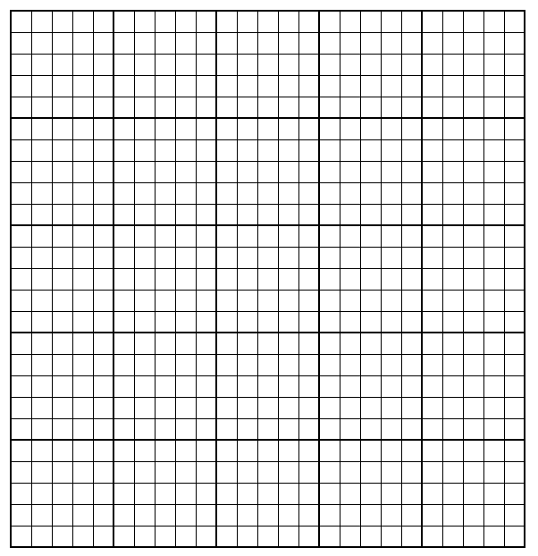

## Pythonを使ってみようかなと思っていただくためのスライド

2018 Summer

@emi_2sheds

---
### ゲームをします

---
### ルール
- 2 x 2のマスが4つつながっています
- マス内には「A」「T」「G」「C」が入ります
- 同じ列・行、太枠内にはATGCが1回だけ入ります

---
### 問題1
- 黄色のマスには何が入りますか？

- 解答は↓

+++
### 問題1の解答

---
### 私はこのゲームを「nucleotideを独つずつ入れる遊び（nu独）」と呼びます

---
### もう一問 いきます

---
### nu独 問題2

---
### もう ~~~数独~~~ nu独解きたくない！

---
### そうだ、Pythonで解こう！

---?code=solve_nudoku_ex1.py

- スクロールしてコードを最後まで表示できます

---
### nu独 問題2の解答

- 解答は↓

+++

- Python実行結果と一致

---
### これくらいならプログラム使わないで解けると思ったあなた

---
### 私はタンパク質の研究をしています

---
### アミノ酸は何種類あるかご存知ですか

---
### IUPACには23種類のアミノ酸表記が定義されています
- http://www.bioinformatics.org/sms2/iupac.html

---
### 「amino acidを 以下略 （ami独）」 ルール
- 5 x 5のマスが5つつながっています
- マス内には25種類の文字（アミノ酸23種、＊、-）が入ります
  - ＊は停止コドン、-はその他を示します
- 同じ列・行、太枠内には25種類の文字が1回だけ入ります

---
### ami独のテンプレート

---
### これは解きたくない

---
### でもnu独用のプログラムを少し変えるだけで解けるのですそうPythonなら

---
## 完
